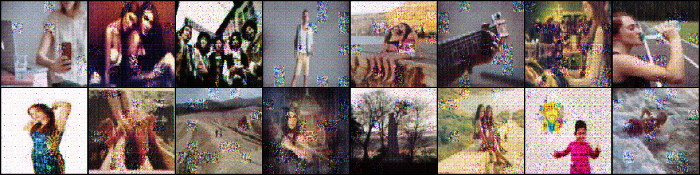

# genFill: Image Inpainting with GAN in PyTorch

genFill is an experimental GAN-based inpainting model designed to fill missing regions in images by predicting and generating content for holes in an image. Built with PyTorch, this project is a failed experiment, aiming to explore GAN-based techniques in image inpainting. Although the model did not achieve convergence, this repository serves as documentation of the attempt, model design, and insights gathered.

## Outputs

As you can see, the outputs are noisy and doesn't fill in the holes.

## Project Description

genFill uses a GAN model to perform image inpainting. The model includes three main components:
1. **Hole Predictor**: Identifies areas with missing content within the input image.
2. **Generator**: Fills in the holes by generating coherent image content.
3. **Discriminator**: Assesses the generated content's realism, distinguishing it from real image patches.

This project drew inspiration from advancements in image inpainting and attention-based architectures, aiming to explore and refine GAN-based techniques for robust inpainting solutions.

## Architecture Overview

genFill's architecture consists of three primary models:

1. **Hole Predictor Model**: Determines where holes (regions with missing content) are located within the image, helping guide the generator.
2. **Generator Model**: A conditional GAN model that receives hole predictions and uses these to fill in the gaps.
3. **Discriminator Model**: Evaluates the generated image regions for authenticity, providing feedback to improve the generator’s output.

## Model Design and Techniques

### Hole Detection Model
- **Model**: HolePredictorModel
- **Architecture**: 
  - Utilizes downscaling blocks to reduce image dimensions and focus on regions with missing content.
  - Applies residual blocks for enhanced feature extraction.
  - Outputs a probability map highlighting hole locations, using a sigmoid activation.
- **Inspiration**: **"Attention is All You Need"** paper's focus on attention-based structures for targeted predictions.

### Generator Model
- **Model**: FillerModel
- **Architecture**:
  - Downscales and then upscales the input to preserve spatial context.
  - Incorporates residual blocks to learn complex features in the generated regions.
  - Uses a tanh activation on the final output layer to limit pixel values.
- **Inspiration**: Attention-based mechanisms to refine and complete missing image areas.

### Discriminator Model
- **Model**: Discriminator
- **Architecture**:
  - Inherits structure from HolePredictorModel but modified to accept both generated and real image pairs (concatenated with six channels).
  - Uses downscaling and residual blocks to differentiate real vs. generated content.
- **Inspiration**: **pix2pix model** for multi-output discrimination.

## Dataset and DataLoader

### FillerDataset
- **Function**: Loads images, applies transformations, and introduces holes at random positions.
- **Features**:
  - Generates holed images alongside the original images for training.
  - Configurable noise levels and intensities to diversify training data.

### FillerDataLoader
- **Function**: Processes each batch and leverages `HolePredictorModel` to generate predictions for missing regions.
- **Features**:
  - Integrates hole prediction directly in data loading, improving efficiency.
  - Configurable for training on various devices with batch handling.

## Challenges and Limitations

Despite significant effort, the model encountered challenges in achieving convergence during training. Key issues included:
- Difficulty in maintaining stable GAN training due to mode collapse.
- Insufficient variety in dataset for handling diverse hole shapes and positions.
- Limitations in generator’s capability to generalize over large missing regions.

## References

- Vaswani, Ashish, et al. **Attention is All You Need**.
- Isola, Phillip, et al. **Image-to-Image Translation with Conditional Adversarial Networks (pix2pix)**.

## License

This project is licensed under the Apache 2.0 License - see the [LICENSE](https://github.com/ivanrj7j/genFill/blob/main/LICENSE) file for details.